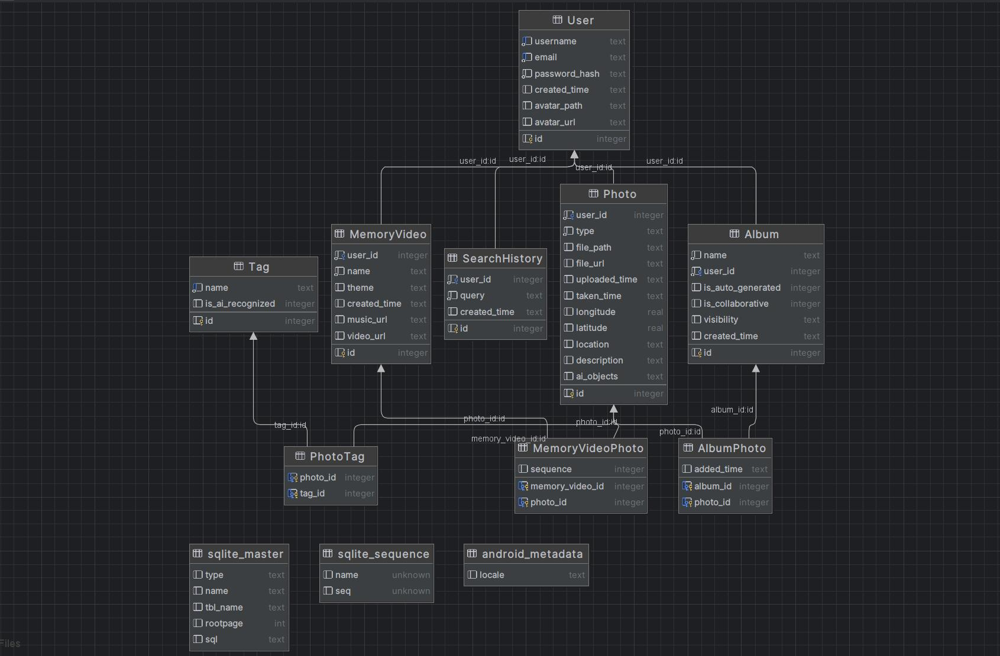

# Software Engineering Sprint1

# 1. Architectural Design

这个相册应用采用了分层架构（Layered Architecture），系统逻辑被划分为多个职责清晰的层，每一层只处理自己的任务，并通过明确的接口与相邻层进行通信。整个架构具有高内聚、低耦合的优点，便于维护和扩展。

## Diagrams:

Database ER diagram

## Natural language description:

### 用户界面层（UI层）

职责：负责与用户进行交互，包括展示相册和照片列表、响应点击事件、显示加载状态等。

实现方式：使用 Fragment（如 AlbumFragment 和 PhotoFragment）结合 RecyclerView 展示内容。

特点：

- 只负责展示，不处理任何业务逻辑。
- 通过观察 ViewModel 暴露的 LiveData 或 StateFlow 来刷新界面。
- 所有用户操作（如点击相册、滑动照片）都会通过 UI 层传递给 ViewModel。

### 业务逻辑层（ViewModel层）

职责：作为 UI 和数据之间的中间层，负责业务逻辑处理、状态管理和数据转换。

实现方式：使 用 AlbumViewModel、PhotoViewModel 分别管理相册列表和照片列表的状态。

特点：

- 不直接访问数据库，只通过 Repository 获取数据。
- 包含加载数据、响应点击事件、缓存状态等业务逻辑。
- 将数据处理为 UI 所需格式，并通过 LiveData 或 Flow 提供给 UI 层。

### 数据访问层（DAO）

职责：封装数据操作逻辑，决定数据来源（数据库、本地文件、网络等），并统一提供数据访问接口。

实现方式：

- Repository 调用 SQLite 提供的 DAO（Data Access Object）与数据库交互。
    
    特点：
    
- 可灵活切换数据源（如未来增加云同步功能时只需修改 Repository 层）。
- 隐藏数据源细节，提供简洁的接口供 ViewModel 使用。

### 数据层（数据库）

职责：存储所有相册信息、照片信息及它们之间的对应关系。

实现方式：使用 Android 的 SQLite 数据库，定义 Album、Photo 等表结构和关联关系。

特点：

- 是整个应用中数据的最终来源。
- 支持数据持久化，应用关闭后仍保留用户数据。
- 通过 DAO 实现基本的增删改查操作。

# 2. UI Design

## UI design for primary user interfaces

### Tool: Figma

.png)

.png)

.png)

.png)

.png)

.png)

.png)

.png)
